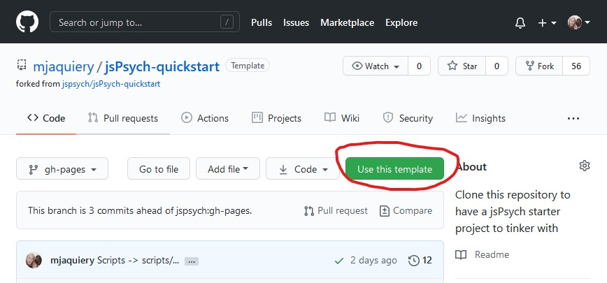
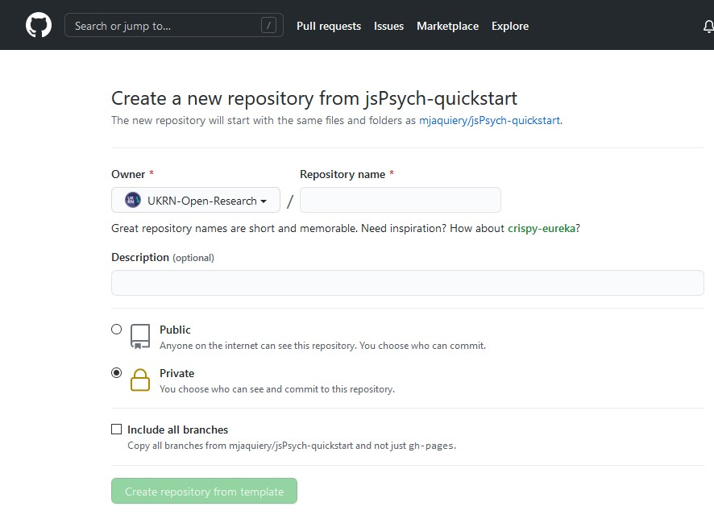
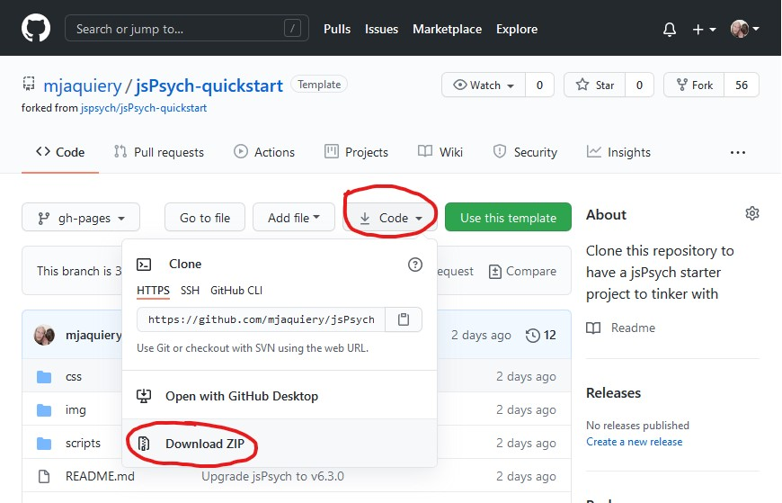

In this tutorial, we'll adapt the jsPsych quickstart project to save data directly to the OSF.
The first thing we need to do, then, is to get the basic jsPsych quickstart project working.

There are two ways of getting the files that we'll cover:
* **If you have a GitHub account** you'll copy the project by using it as a template and then cloning it to your local computer
    * This is the easiest way, and means git is already set up on the project
* Otherwise, you'll download the repository files as a .zip archive and extract it

### Copying the Repository

#### Copying a Template

1. Go to the repository page ([https://github.com/mjaquiery/jsPsych-quickstart](https://github.com/mjaquiery/jsPsych-quickstart))
2. Click 'Use this template' in the top-right

3. Fill in the template copy form

4. You will then be taken to the newly created repository.
Clone this repository by copying its clone URL (click "Code" then the copy icon)

5. Open a terminal/command window on your computer and `cd` to your webserver root directory.
    * If you're using GitHub Desktop or another application to manage your GitHub repositories, you can use that to clone your new repository instead
    *
6. Clone the repository by typing `git clone URL` where `URL` is the clone URL you copied in step 4.

#### Downloading a .zip

1. Go to the repository page ([https://github.com/mjaquiery/jsPsych-quickstart](https://github.com/mjaquiery/jsPsych-quickstart))
2. Click the 'Code' button, then the 'Download ZIP'

3. Extract the files to your webserver root directory

### Checking it works

With the files now in place, the project should now be served with the local webserver.
Check the webserver is running, then open a browser and navigate to [localhost/jsPsych-quickstart/index.html](http://localhost/jsPsych-quickstart/index.html).

You should see the quickstart welcome screen:

You can take a moment to perform the experiment if you like - you'll see ten circles in succession, each in one of two colours, and you'll press a different key for each colour.
At the end of the experiment you'll be told your mean response time and see the data recorded from the trials.

If you're having problems, make sure you ask for help!
