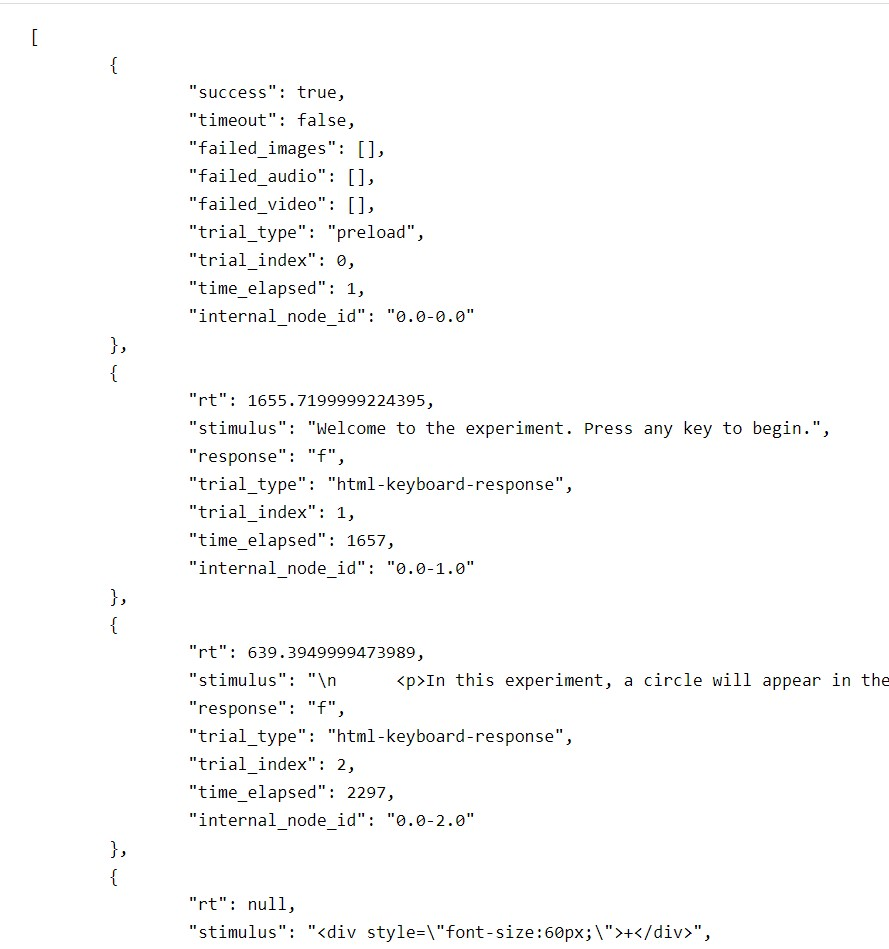

When the participant completes one of our experiments, their computer sends the data to our server, and our server saves the data to the appropriate place.
We are editing this workflow so that the server sends the data to the OSF instead of saving it locally.

The jsPsych quickstart project doesn't send data to the server automatically, so we're going to write a bit of code that does that now.

> When we finish the experiment currently, it prints out our data in .JSON (JavaScript Object Notation) format.
> 
>
> Which line of code is responsible for this behaviour?
> > ## Solution
> >
> > - line 115: `jsPsych.data.displayData();`
> > - This function is called when the jsPsych timeline finishes (`onFinish`), and displays the data as explained [in the jsPsych documentation](https://www.jspsych.org/core_library/jspsych-data/#jspsychdatadisplaydata)
> {: .solution}
{: .challenge}

The first thing we'll do is change the output from .JSON format to .CSV format by adding the argument 'CSV' to the `jsPsych.data.displayData()` call: `jsPsych.data.displayData('CSV')`.

Now when we complete the study we see the data in .CSV (comma-separated value) format.
It is a lot harder to read, but that's only because jsPsych was doing some neat formatting of the .JSON data for us, and it won't do the same for .CSV.

> .CSV is a tabular format, making it easy to work with during statistical analysis.
>
> Both .CSV and .JSON are open formats, widely understood by all kinds of software.
> This means that data stored in .JSON or .CSV are likely to be [**interoperable**](https://www.go-fair.org/fair-principles/i1-metadata-use-formal-accessible-shared-broadly-applicable-language-knowledge-representation/)
{: .callout}

Now we know what format we want to save the data in, we make sure we're sending the right bits of the data to the server.

For a project that has private data, e.g. Prolific or MTurk ids, we might want to split that data out of the jsPsych data, but for this project we don't need to do that.
We will, however, create our own participant identifier to keep things nice and organised.
If we did have to split out private data, we could use our identifier to link the private data to the public data, so we could e.g. check whether a participant's data looked sensible before authorising payment.

> ## Tip
> You've probably found repeatedly doing the experiment to be tedious and time-consuming by now.
> We can reduce the time taken to navigate through the experiment in several ways, but a quick and convenient one here is to reduce the maximum duration of the stimulus presentation by removing the longer options on `line 64`. We could also decrease the number of repetitions on `line 87`.
{: .solution}

To create a participant identifier we'll use the approach recommended in the [jsPsych documentation](https://www.jspsych.org/overview/data/#adding-data-to-all-trials).
We'll use the first line of code in the example, where the participant is assigned a 15-character random code.
This code isn't _guaranteed_ to be unique, but the chances of two codes being the same by accident are very very low indeed.

We want this added before we begin the experiment (i.e. before `line 112`), because we'll want it to appear near the beginning of the data.
We may as well put it right up the top of our `<script></script>` section, on `line 15`.

> ## Adding the participant_id
> We want to add a participant_id, so we'll some code that looks like:
> ```javascript
> // Not guaranteed to be unique, but clashes should be very rare
> var participant_id = jsPsych.randomization.randomID(15);
> // Add the property to the data for all trials
> jsPsych.data.addProperties({participant_id});
> ```
> {: .source}
{: .solution}

Finally, we want to send data to the server when we're finished rather than simply showing it to the participant.
First, we'll make sure we have jQuery loaded, because that will make uploading the data to the server easier.
Go to `index.html:5` (`index.html` `line 5`) and add some lines just below the `<title></title>` tags:

```html
<!-- Include jQuery via Content Deployment Network. CDN embed tags for all jQuery version are listed at https://code.jquery.com/ -->
<script
        src="https://code.jquery.com/jquery-3.5.1.min.js"
        integrity="sha256-9/aliU8dGd2tb6OSsuzixeV4y/faTqgFtohetphbbj0="
        crossorigin="anonymous"></script>
```
{: .source}

Now we're ready to change the `onFinish` function to send data to the server using AJAX (Asynchronous JavaScript And XML).
Edit the `jsPsych.init(...)` bit of the script to resemble the below:
```javascript
/* start the experiment */
jsPsych.init({
    timeline: timeline,
    on_finish: function() {
        document.querySelector('#jspsych-content').innerHTML = `<p>Uploading data to OSF...</p>`;
        // use jQuery to send data to the backend
        $.ajax({
            type: 'post',
            cache: false,
            url: 'save_data.php',
            data: {
                // we'll use the participant id for naming the file
                participant_id,
                // explicitly note the data are public!
                // jsPsych.data.get().csv() provides the data in .CSV format
                public_data: jsPsych.data.get().csv()
            },
            // Function to run when complete. 'r' is the response from the server.
            success: r => {
                console.log(r);
                document.querySelector('#jspsych-content').innerHTML = `<h1>Success!</h1><p>Data successfully uploaded to the OSF.</p>`;
            },
            // Function to run if an error occurs. 'e' is the response from the server.
            fail: e => {
                console.log(e);
                document.querySelector('#jspsych-content').innerHTML = `<h1>Error!</h1><p>There was a problem uploading data to the OSF.</p>`;
            }
        });
    }
});
```
{: .source}

We're now ready.
If we try the experiment now, we should find that it tells us that there was a problem uploading data to the OSF.
That's because we're trying to send the data to a file that doesn't exist on the server (`save_data.php`).
In the next step, we'll create that file and send the incoming data to the OSF.
