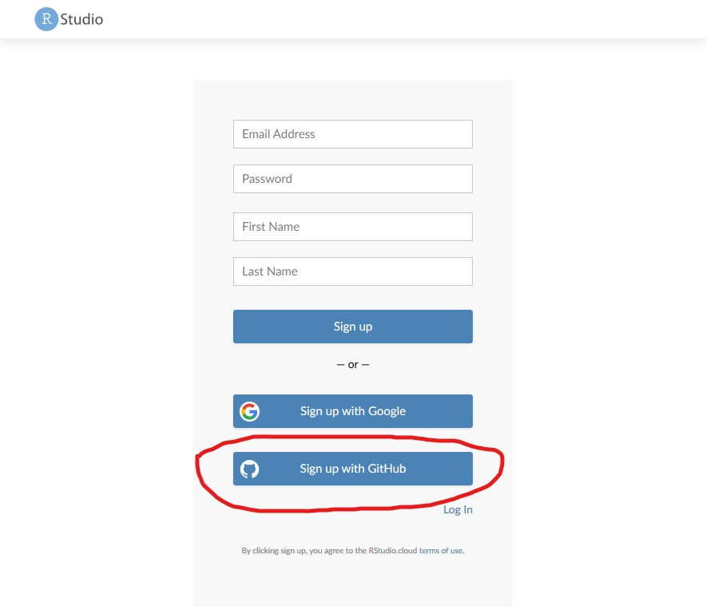

## Accessing using OSFr in R

The first step is to sign into RStudio Cloud using your GitHub account.
* Go to [https://rstudio.cloud/](https://rstudio.cloud/) and click 'Get Started for Free'

    * Sign up for the free account level
    
    * And then select 'Sign up with GitHub Account'
    
    * Sign into GitHub, and authorize the RStudio Cloud application

Now you've created an RStudio Cloud account, you can clone the example OSFr project and use it to access your data.
* Select 'New Project from Git Repository'

   * Enter `https://github.com/UKRN-Open-Research/OSFr-example.git` and click 'OK'
   
   * Wait while the project loads

To execute the project, we need to install the packages it depends on.
Because the project uses the `renv` package to manage packages, we can install all the required packages by entering `renv::restore()` in the console and pressing `[ENTER]`.
It will take a little while for the packages to install.

We then click on `download_data.R` to open that file.
We'll see that it opens as a pane in the top-left of the screen.

* We need to tell the script where to find our files.
This is done by changing the `osf_component` variable (line 3) to be our component id we made a note of earlier.

    * When the `osf_component` is updated, run the script by clicking the 'source' button in the top pane.
    * Once the script has run, you can find your data in the `raw_data` directory in the files pane (bottom-right)

## Downloading as .zip

You can also download your data directly from the OSF as a .zip (or as individual .csv files).

This is as simple as going to your project in the OSF, selecting the OSF Storage in the Files browser pane, and clicking the 'Download as zip' button.

> ## Note:
> At no point in these process did we tell the R script (or need to tell the web browser) who we were.
> The data are public, and can be accessed easily and immediately by anyone, including ourselves.
>
> We can even write our analysis scripts to download the raw data each time, and thus track the raw data all the way to the figures and statistics we eventually produce for publication.
{: .callout}
