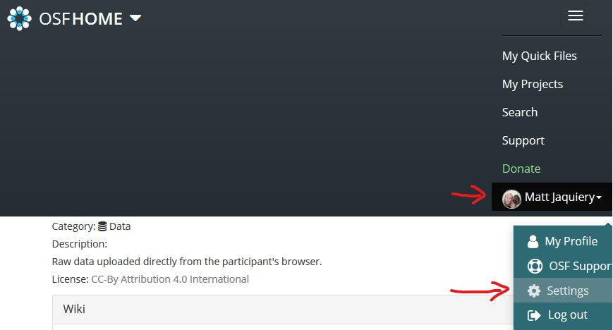
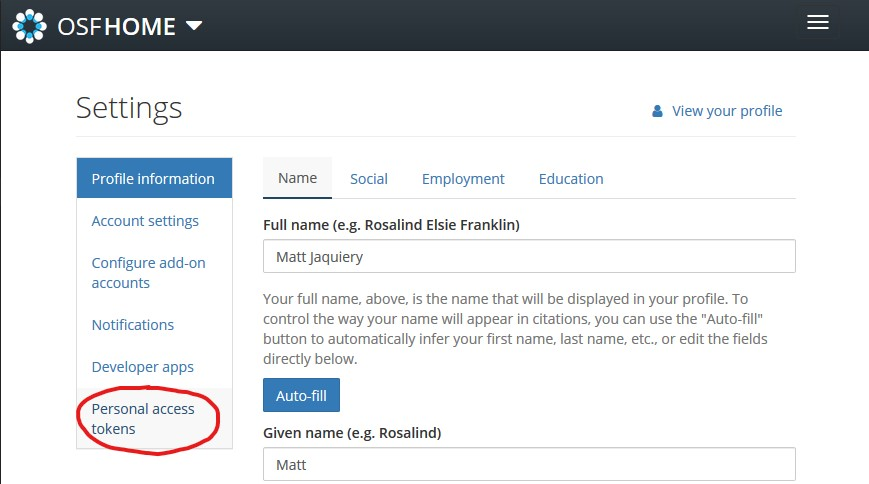
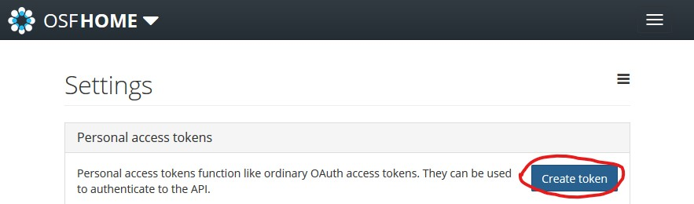
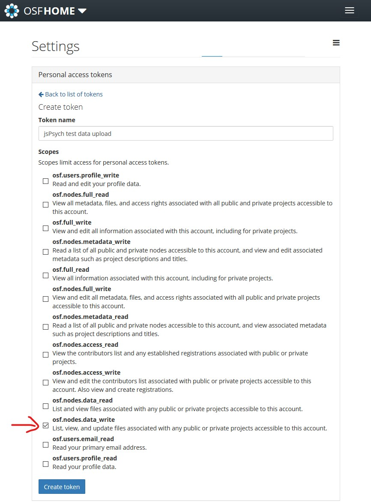
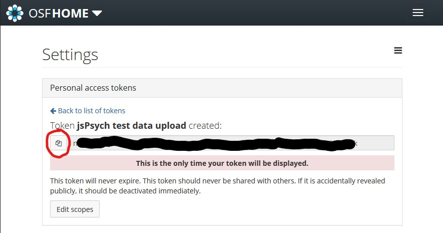

We'll be creating a new personal access token (PAT) on the OSF.
The personal access token is a secret passcode known only to the OSF and to you.
Later, you will tell your save script (`save_data.php`) what the access token is, and the script can then pass the token on to the OSF when it tries to save the data.
If your save script provides an acceptable token, the OSF will accept the data.
In essence, by providing your PAT, you are authorising the save script to act on your behalf.

1. Make sure you're still on the OSF test subdomain ([test.osf.io](https://test.osf.io/))
2. Open your account submenu and select 'settings'

3. Select the 'Personal access tokens' section

4. Create a new PAT

5. Scopes determine what a program using the PAT is allowed to do.
Note that these scopes apply to **all of your projects**.
To upload data, we will need the `osf.nodes.data_write` scope, so make sure that box is checked.

6. You will now see your token.
This is the only time you'll see this, so make sure you copy it and note it down somewhere, because we'll need it later.
If you forget it, you can always create another one, and if you accidentally share it publicly you can always delete the shared one and create a new one.
Copy the token into a temporary document so you have it for later.

You now have an OSF project component to save data into, and a PAT which will allow your script to upload the data there.
Next, we'll change the jsPsych quickstart project to send the data to the OSF.
